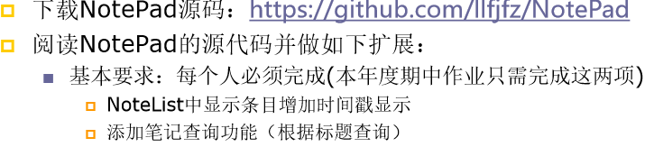
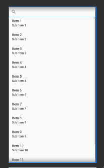
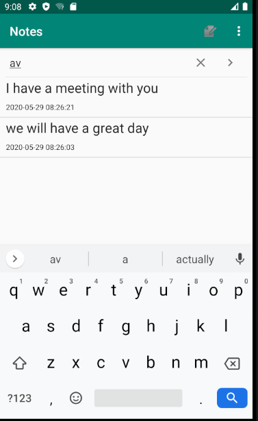

# 116072017010         李伟楠        软工闽台



## 一、NotList中显示条目增加时间戳显示：

1，在布局文件中增加一个显示时间戳的TextView

```
<TextView
        android:id="@+id/text2"
        android:layout_width="match_parent"
        android:layout_height="match_parent"
        android:textAppearance="?android:attr/textAppearanceLarge"
        android:textSize="12dp"
        android:gravity="center_vertical"
        android:paddingLeft="10dip"
        android:singleLine="true"
        android:layout_weight="1"
        android:layout_margin="0dp"
        />
```

2，在NodeRditor.java中，修改。

​		在updateNode()函数中，增加

```
Date nowTime = new Date(System.currentTimeMillis());
        SimpleDateFormat sdFormatter = new SimpleDateFormat("yyyy-MM-dd HH:mm:ss");
        String retStrFormatNowDate = sdFormatter.format(nowTime);
        ContentValues values = new ContentValues();
        values.put(NotePad.Notes.COLUMN_NAME_MODIFICATION_DATE, retStrFormatNowDate);
```

并将其格式化输入到数据库中

3，在NoteList.java中找到PROJECTION添加一个元素

```
    private static final String[] PROJECTION = new String[] {
            NotePad.Notes._ID, // 0
            NotePad.Notes.COLUMN_NAME_TITLE, // 1
            NotePad.Notes.COLUMN_NAME_MODIFICATION_DATE,
    };
```

4，设置dataColumns和viewIDs，让其能够显示出来

```
     private String[] dataColumns = { NotePad.Notes.COLUMN_NAME_TITLE ,NotePad.Notes.COLUMN_NAME_MODIFICATION_DATE} ;
     private int[] viewIDs = { R.id.text1,R.id.text2 };
```

最后运行效果


## 二、添加笔记查询功能（根据标题查询） 

1，在listview布局文件中加入搜索控件

```
    <android.support.v7.widget.SearchView
        android:id="@+id/sv"
        android:layout_width="match_parent"
        android:layout_height="wrap_content"
        >
    </android.support.v7.widget.SearchView>
```



在NoteList.java中增加搜索函数进行模糊查询，

函数中对onQueryTextChange进行判断，一旦字段有所变化就进行一次查询操作

```
private void SearchView(){
        searchView=findViewById(R.id.sv);
        searchView.onActionViewExpanded();
        searchView.setQueryHint("搜索");
        searchView.setSubmitButtonEnabled(true);
        searchView.setOnQueryTextListener(new SearchView.OnQueryTextListener() {
            @Override
            public boolean onQueryTextSubmit(String s) {
                return false;
            }

            @Override
            public boolean onQueryTextChange(String s) {
                if(!s.equals("")){
                    String selection=NotePad.Notes.COLUMN_NAME_TITLE+" GLOB '*"+s+"*'";
                    updatecursor = getContentResolver().query(
                            getIntent().getData(),            
                            PROJECTION,                       
                            selection,                            
                            null,                             
                            NotePad.Notes.DEFAULT_SORT_ORDER  
                    );
                    if(updatecursor.moveToNext())
                        Log.i("daawdwad",selection);
                }
                else {
                    updatecursor = getContentResolver().query(
                            getIntent().getData(),            
                            PROJECTION,                       
                            null,                             
                            null,                             
                            NotePad.Notes.DEFAULT_SORT_ORDER  
                    );
                }
                adapter.swapCursor(updatecursor);  
                return false;
            }
        });
    }
```

运行效果：


