# *创建一个Android工程并同步到Github**

## 实验条件

1.Android studio3.5

2.Git

## 实验步骤

### 创建一个新工程

点击左上角File->New->New project...

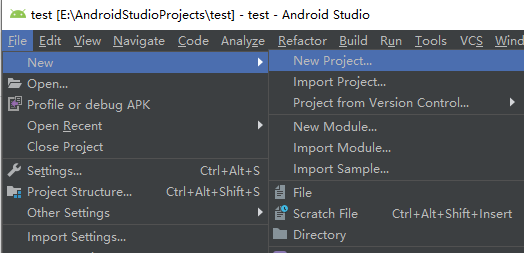

选择需要的样式，我这里选择Empty Activity

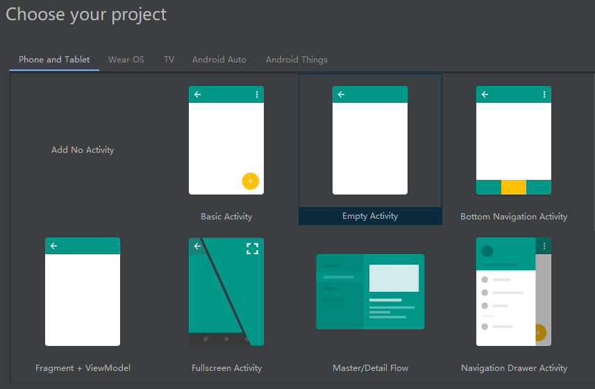

点击Next，填写工程的信息

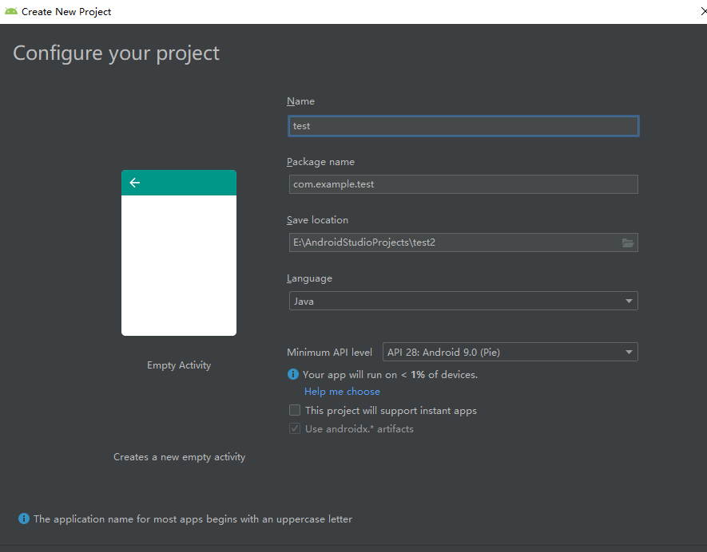

点击Finish完成

点击工具栏中的标志，点击Create Virtual Device...

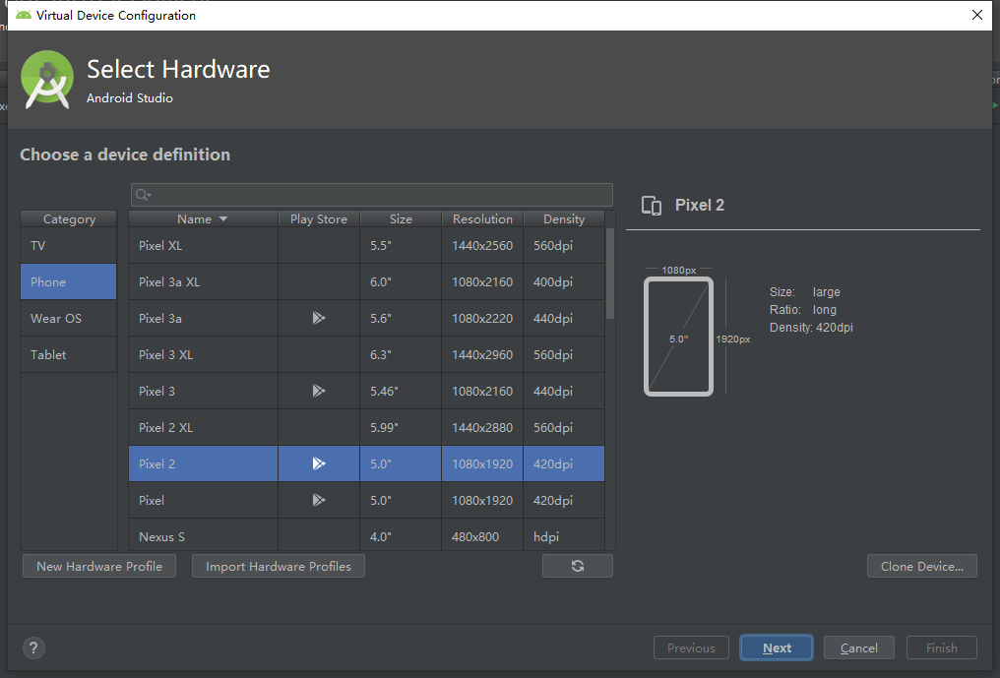

选择需要的尺寸，点击Next，选择适合自己cpu的系统，点next

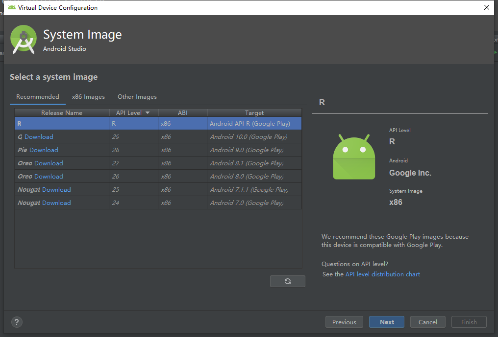

设置需要改动的参数，我这里选择默认，点击finish

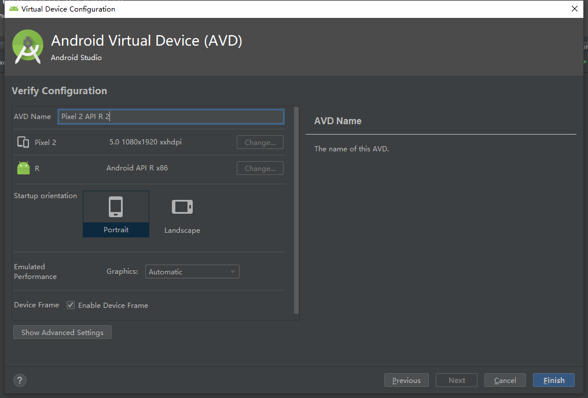

可以看到已经创建出一个虚拟设备，点击启动

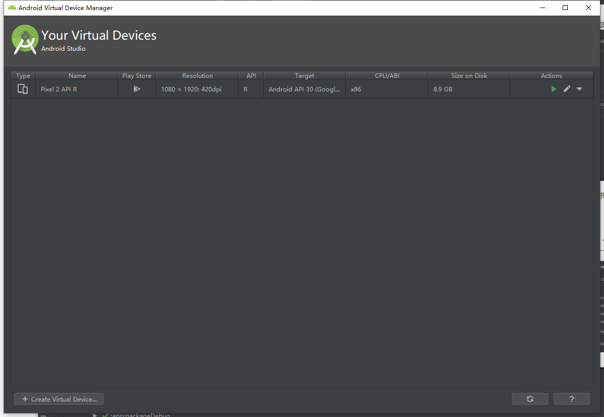

选择test中的app，和刚刚设置的虚拟设备

运行后显示为

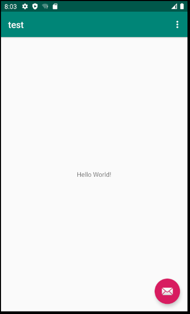

### 将代码推送到github

点击左上角File->Settings... ，在Version Control中设置Git

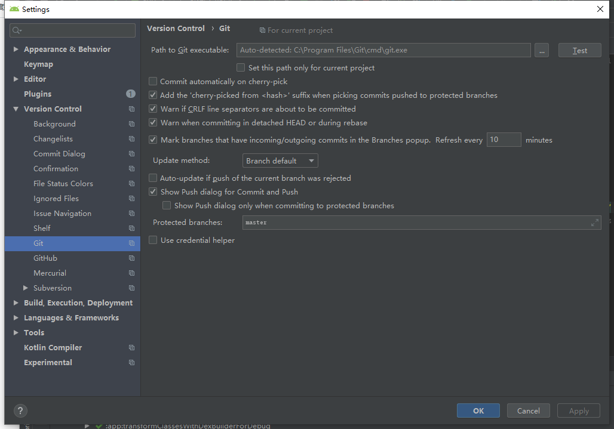

设置Github

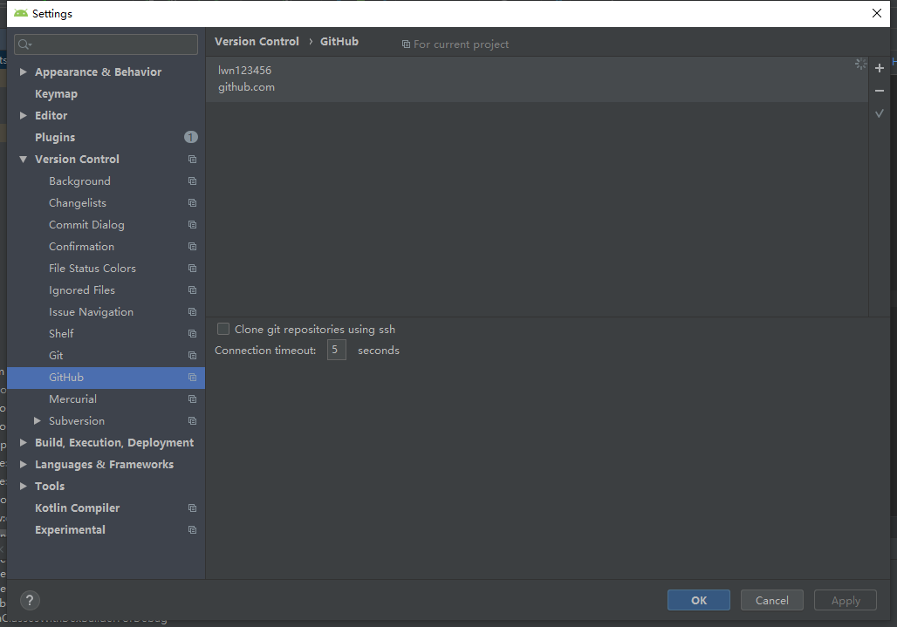

点击Window左边的VCS

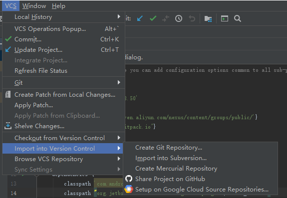

create Git Repository...为创建本地厂库

share project on GitHub为分享工程到github

2项依次点击后即可上传

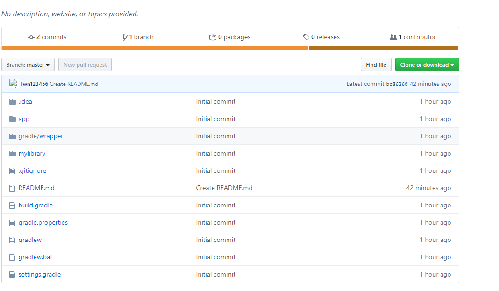