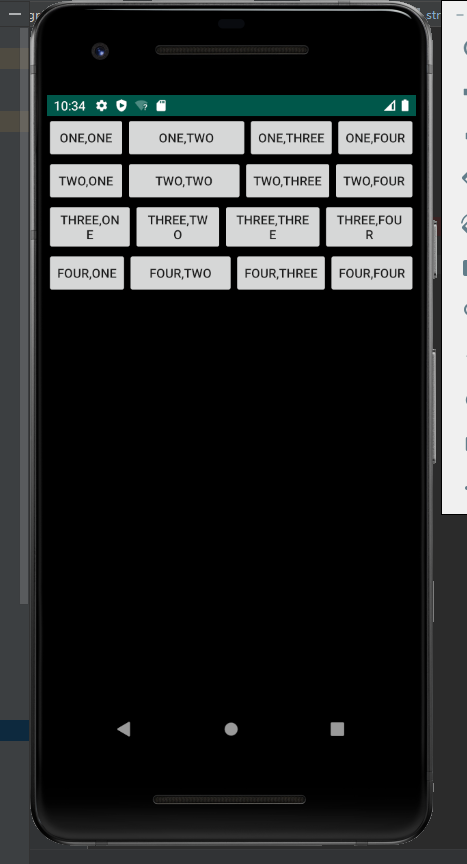
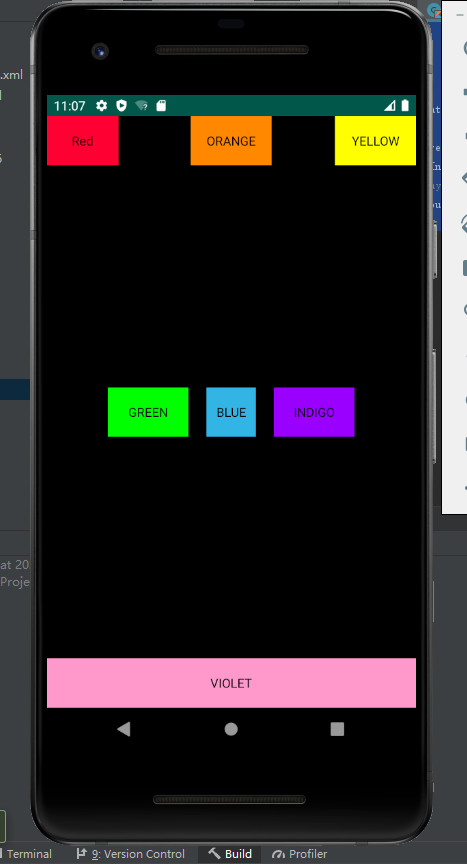
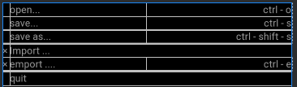
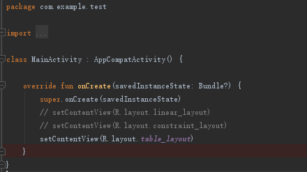
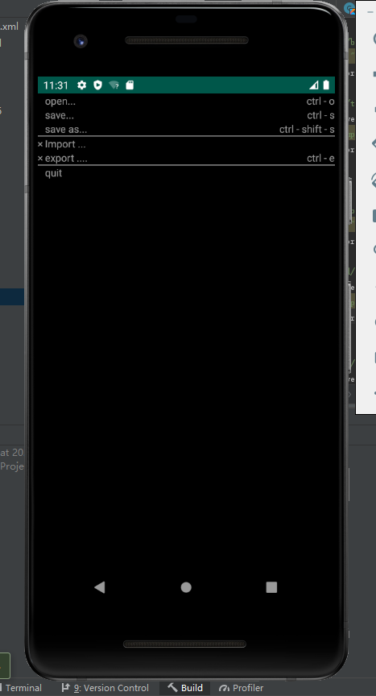

# 实验二：Android布局

工程文件在test里，是在test实验一的同一工程上更改的

## 一，线性布局

将布局类型设置为vertical，在每个linearlayout中包含4个button

linear_layout.xml代码：

`<?xml version="1.0" encoding="utf-8"?>`
`<LinearLayout xmlns:android="http://schemas.android.com/apk/res/android"`
    `android:layout_width="match_parent"`
    `android:layout_height="match_parent"`
    `android:background="@color/colorBlack"`
    `android:orientation="vertical">`
    `<LinearLayout`
        `android:layout_width="match_parent"`
        `android:layout_height="wrap_content">`
        `<Button`
            `android:layout_width="wrap_content"`
            `android:layout_height="wrap_content"`
            `android:id="@+id/btn1"`
            `android:text="@string/a11"/>`
        `<Button`
            `android:layout_width="wrap_content"`
            `android:layout_height="wrap_content"`
            `android:id="@+id/btn2"`
            `android:layout_weight="1"`
            `android:text="@string/a12"/>`
        `<Button`
            `android:layout_width="wrap_content"`
            `android:layout_height="wrap_content"`
            `android:id="@+id/btn3"`
            `android:text="@string/a13"/>`

        <Button
            android:layout_width="wrap_content"
            android:layout_height="wrap_content"
            android:id="@+id/btn4"
            android:text="@string/a14"/>
    </LinearLayout>
    <LinearLayout
        android:layout_width="match_parent"
        android:layout_height="wrap_content">
        <Button
            android:layout_width="wrap_content"
            android:layout_height="wrap_content"
            android:id="@id/btn1"
            android:text="@string/a21"/>
        <Button
            android:layout_width="0dp"
            android:layout_height="wrap_content"
            android:id="@id/btn2"
            android:layout_weight="1"
            android:text="@string/a22"/>
        <Button
            android:layout_width="wrap_content"
            android:layout_height="wrap_content"
            android:id="@id/btn3"
            android:text="@string/a23"/>
    
        <Button
            android:layout_width="wrap_content"
            android:layout_height="wrap_content"
            android:id="@id/btn4"
            android:text="@string/a24"/>
    </LinearLayout>
    <LinearLayout
        android:layout_width="match_parent"
        android:layout_height="wrap_content">
        <Button
            android:layout_width="wrap_content"
            android:layout_height="wrap_content"
            android:layout_weight="1"
            android:id="@id/btn1"
            android:text="@string/a31"/>
        <Button
            android:layout_width="wrap_content"
            android:layout_height="wrap_content"
            android:id="@id/btn2"
            android:layout_weight="1"
            android:text="@string/a32"/>
        <Button
            android:layout_width="wrap_content"
            android:layout_height="wrap_content"
            android:layout_weight="1"
            android:id="@id/btn3"
            android:text="@string/a33"/>
    
        <Button
            android:layout_width="wrap_content"
            android:layout_height="wrap_content"
            android:layout_weight="1"
            android:id="@id/btn4"
            android:text="@string/a34"/>
    </LinearLayout>
    <LinearLayout
        android:layout_width="match_parent"
        android:layout_height="wrap_content">
        <Button
            android:layout_width="wrap_content"
            android:layout_height="wrap_content"
            android:id="@id/btn1"
            android:text="@string/a41"/>
        <Button
            android:layout_width="wrap_content"
            android:layout_height="wrap_content"
            android:id="@id/btn2"
            android:layout_weight="1"
            android:text="@string/a42"/>
        <Button
            android:layout_width="wrap_content"
            android:layout_height="wrap_content"
            android:id="@id/btn3"
            android:text="@string/a43"/>
    
        <Button
            android:layout_width="wrap_content"
            android:layout_height="wrap_content"
            android:id="@id/btn4"
            android:text="@string/a44"/>
    </LinearLayout>
`</LinearLayout>`

在values文件的strings.xml中设置对应值

`<resources>`
    `<string name="a11">one,one</string>`
    `<string name="a12">one,two</string>`
    `<string name="a13">one,three</string>`
    `<string name="a14">one,four</string>`
    `<string name="a21">two,one</string>`
    `<string name="a22">two,two</string>`
    `<string name="a23">two,three</string>`
    `<string name="a24">two,four</string>`
    `<string name="a31">three,one</string>`
    `<string name="a32">three,two</string>`
    `<string name="a33">three,three</string>`
    `<string name="a34">three,four</string>`
    `<string name="a41">four,one</string>`
    `<string name="a42">four,two</string>`
    `<string name="a43">four,three</string>`
    `<string name="a44">four,four</string>`
`</resources>`

在colors.xml中增加黑颜色的值

`<color name="colorBlack">#000000</color>`

最后将MainActivity中的onCreate方法修改成我们需要的linear_layout.xml

`package com.example.test`

`import android.os.Bundle`
`import com.google.android.material.snackbar.Snackbar`
`import androidx.appcompat.app.AppCompatActivity`
`import android.view.Menu`
`import android.view.MenuItem`

`import kotlinx.android.synthetic.main.activity_main.*`

`class MainActivity : AppCompatActivity() {`

    override fun onCreate(savedInstanceState: Bundle?) {
        super.onCreate(savedInstanceState)
        setContentView(R.layout.linear_layout)
    
    }
`}`

运行试试看吧



## 二，约束布局

创建constraint_layout.xml，代码：

`<?xml version="1.0" encoding="utf-8"?>`

`<androidx.constraintlayout.widget.ConstraintLayout xmlns:android="http://schemas.android.com/apk/res/android"`
    `xmlns:app="http://schemas.android.com/apk/res-auto"`
    `android:layout_width="match_parent"`
    `android:layout_height="match_parent"`
    `android:background="@color/colorBlack">`
    `<TextView`
        `android:id="@+id/textView1"`
        `android:layout_width="80dp"`
        `android:layout_height="55dp"`
        `android:background="@color/colorRed"`
        `android:text="Red"`
        `android:gravity="center"`
        `android:textColor="@color/colorBlack"`
        `app:layout_constraintStart_toStartOf="parent"`
        `app:layout_constraintTop_toTopOf="parent"/>`

    <TextView
        android:layout_width="90dp"
        android:layout_height="55dp"
        android:id="@+id/textView2"
        android:text="ORANGE"
        android:textColor="@color/colorBlack"
        android:gravity="center"
        android:background="@android:color/holo_orange_dark"
        app:layout_constraintEnd_toEndOf="parent"
        app:layout_constraintStart_toStartOf="parent"
        app:layout_constraintTop_toTopOf="parent"
        />
    <TextView
        android:layout_width="90dp"
        android:layout_height="55dp"
        android:id="@+id/textView3"
        android:text="YELLOW"
        android:textColor="@color/colorBlack"
        android:gravity="center"
        android:background="@color/colorYellow"
        app:layout_constraintTop_toTopOf="parent"
        app:layout_constraintEnd_toEndOf="parent"
        />
    <TextView
        android:layout_width="55dp"
        android:layout_height="55dp"
        android:id="@+id/textView5"
        android:text="BLUE"
        android:textColor="@color/colorBlack"
        android:gravity="center"
        android:background="@android:color/holo_blue_light"
        app:layout_constraintTop_toTopOf="parent"
        app:layout_constraintEnd_toEndOf="parent"
        app:layout_constraintStart_toStartOf="parent"
        app:layout_constraintBottom_toBottomOf="parent"
        />
    <TextView
        android:layout_width="90dp"
        android:layout_height="55dp"
        android:id="@+id/textView4"
        android:text="GREEN"
        android:textColor="@color/colorBlack"
        android:gravity="center"
        android:background="@color/colorGreen"
        app:layout_constraintTop_toTopOf="parent"
        app:layout_constraintEnd_toStartOf="@id/textView5"
        android:layout_marginEnd="20dp"
        android:layout_marginStart="20dp"
        app:layout_constraintBottom_toBottomOf="parent"
        />
    <TextView
        android:layout_width="90dp"
        android:layout_height="55dp"
        android:id="@+id/textView6"
        android:text="INDIGO"
        android:textColor="@color/colorBlack"
        android:gravity="center"
        android:background="@color/colorIndigo"
        app:layout_constraintTop_toTopOf="parent"
        app:layout_constraintStart_toEndOf="@id/textView5"
        android:layout_marginEnd="20dp"
        android:layout_marginStart="20dp"
        app:layout_constraintBottom_toBottomOf="parent"/>
    
    <TextView
        android:layout_width="match_parent"
        android:layout_height="55dp"
        android:text="VIOLET"
        android:textColor="@color/colorBlack"
        android:background="@color/colorViolet"
        android:gravity="center"
        app:layout_constraintBottom_toBottomOf="parent"
        />
`</androidx.constraintlayout.widget.ConstraintLayout>`

使用android:gravity="center"命令使文字居中

在values中的colors.xml中设置颜色

```
<color name="colorBlack">#000000</color>
<color name="colorRed">#FF0033</color>
<color name="colorYellow">#FFFF00</color>
<color name="colorGreen">#00FF00</color>
<color name="colorIndigo">#9900FF</color>
<color name="colorViolet">#FF99CC</color>
```

最后在MainActivity中更改onCreate方法

```
package com.example.test

import android.os.Bundle
import com.google.android.material.snackbar.Snackbar
import androidx.appcompat.app.AppCompatActivity
import android.view.Menu
import android.view.MenuItem

import kotlinx.android.synthetic.main.activity_main.*

class MainActivity : AppCompatActivity() {

    override fun onCreate(savedInstanceState: Bundle?) {
        super.onCreate(savedInstanceState)
        setContentView(R.layout.constraint_layout)
    }
}
```

最后来试试结果吧



## 三，表格布局

仔细观察可以发现，表格布局中的第一列只有符号”x"和空白“”，将textview中的内容设置为对应的"x"""即可

可以利用命令使用android:gravity="right"命令使文字靠右对齐

分割线就是一堆1dp的view了

就像这样



来看看代码部分（创建文件table_layout）：

`<?xml version="1.0" encoding="utf-8"?>`
`<TableLayout xmlns:android="http://schemas.android.com/apk/res/android"`
    `android:layout_width="match_parent" android:layout_height="match_parent"`
    `android:background="@android:color/background_dark"`
    `android:shrinkColumns="0"`
    `>`
    `<TableRow>`
        `<TextView
            android:id="@+id/blank"
            android:text="   "
            android:textColor="@color/colorGray" />`
        `<TextView`
            `android:id="@+id/text1"`
            `android:layout_weight="1"`
            `android:text="@string/open"`
            `android:textColor="@color/colorGray" />`

        <TextView
            android:id="@+id/text2"
            android:gravity="right"
            android:layout_weight="1"
            android:text="@string/ctrl"
            android:textColor="@color/colorGray" />
    </TableRow>
    <TableRow>
        <TextView
            android:id="@id/blank"
            android:text=""
            android:textColor="@color/colorGray" />
        <TextView
            android:id="@+id/text3"
            android:layout_weight="1"
            android:text="@string/save"
            android:textColor="@color/colorGray" />
    
        <TextView
            android:id="@+id/text4"
            android:layout_weight="1"
            android:gravity="right"
            android:text="@string/ctrls"
            android:textColor="@color/colorGray" />
    </TableRow>
    <TableRow>
        <TextView
            android:id="@id/blank"
            android:text=""
            android:textColor="@color/colorGray" />
        <TextView
            android:id="@+id/text5"
            android:layout_weight="1"
            android:text="save as..."
            android:textColor="@color/colorGray" />
    
        <TextView
            android:id="@id/text6"
            android:layout_weight="1"
            android:gravity="right"
            android:text="ctrl - shift - s"
            android:textColor="@color/colorGray"
            />
    </TableRow>
    
    <View android:id="@+id/divider"
        android:layout_width="match_parent"
        android:layout_height="1dp"
        android:background="@color/colorGray"
        ></View>
    
    <TableRow>
        <TextView
            android:id="@id/blank"
            android:text="×"
            android:textColor="@color/colorGray" />
        <TextView
            android:id="@id/text6"
            android:layout_weight="1"
            android:text="Import ..."
            android:textColor="@color/colorGray" />
    </TableRow>
    <TableRow>
        <TextView
            android:id="@id/blank"
            android:text="×"
            android:textColor="@color/colorGray" />
        <TextView
            android:id="@+id/text8"
            android:layout_weight="1"
            android:text="export ...."
            android:textColor="@color/colorGray" />
    
        <TextView
            android:id="@+id/text9"
            android:layout_weight="1"
            android:gravity="right"
            android:text="ctrl - e"
            android:textColor="@color/colorGray"
            />
    </TableRow>
    <View android:id="@id/divider"
        android:layout_width="match_parent"
        android:layout_height="1dp"
        android:background="@color/colorGray"
        />
    <TableRow>
        <TextView
            android:id="@id/blank"
            android:text=""
            android:textColor="@color/colorGray" />
        <TextView
            android:id="@+id/text6"
            android:layout_weight="1"
            android:text="quit"
            android:textColor="@color/colorGray" />


    </TableRow>

`</TableLayout>`

在value中colos.xml添加

`<color name="colorGray">#999999</color>`

一开始我将字符串放入strings.xml但是这个实验字符串太多了一个一个弄太麻烦了，后面直接写在代码里了

运行前记得去MainActivity中改一下setContentView



运行一下试试：



马马虎虎

